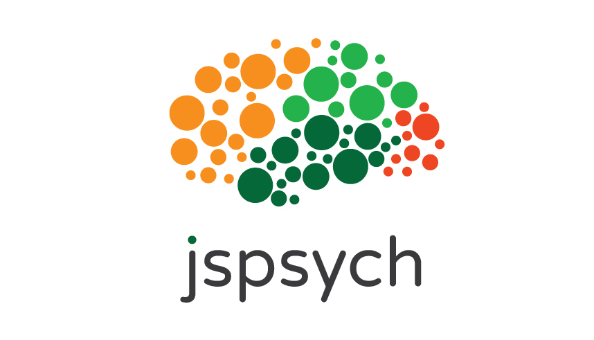

jsPsych is a JavaScript library for creating and running behavioral experiments in a web browser. The library provides a flexible framework for building a wide range of laboratory-like experiments that can be run online.

To use jsPsych, you provide a description of the experiment in the form of [a timeline](features/timeline.md). jsPsych handles things like determining which trial to run next, storing data, and randomization. jsPsych uses *plugins* to define what to do at each point on the timeline. Plugins are ready-made templates for simple experimental tasks like displaying instructions or displaying a stimulus and collecting a keyboard response. Plugins are very flexible to support a wide variety of experiments, and it is easy to create your own plugin if you have experience with JavaScript programming.

[The page on timelines](features/timeline.md) is a good place to start learning about jsPsych. From there, you might want to complete the [Hello World! tutorial](tutorials/hello-world.md) and the [reaction time experiment tutorial](tutorials/rt-task.md).
